# python_labs

## Лабораторная работа 1

### Задание номер 1
```python
name = input('Имя: ')
age = int(input('Возраст: '))
print(f'Привет, {name}! Через год тебе будет {age + 1}.')
```
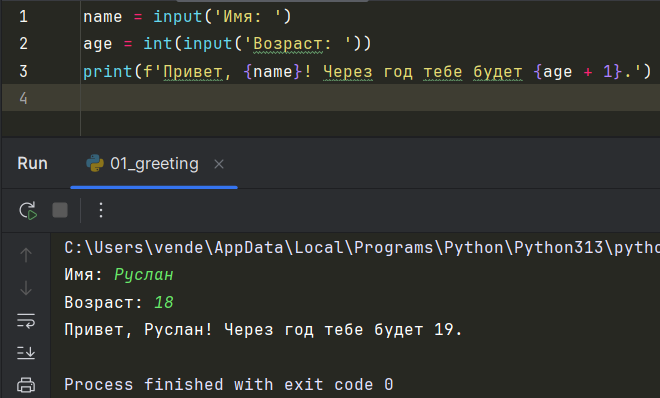

### Заданиет номер 2
```python
num1 = float(input('a: ').replace(',', '.'))
num2 = float(input('b: ').replace(',', '.'))
print(f'sum={num1 + num2}; avg={round(((num1 + num2) / 2), 2)}')
```
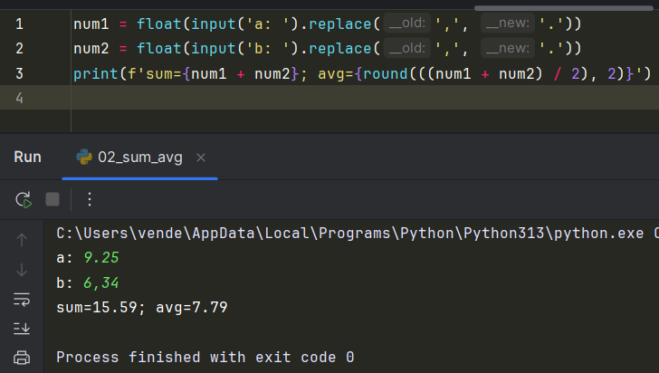

### Задание номер 3
```python
price, discount, vat = float(input('Цена (₽): ')), float(input('Скидка (%): ')), float(input('НДС (%): '))
base = price * (1 - discount / 100)
vat_amount = base * (vat / 100)
total = base + vat_amount
print(f'База после скидки: {format(base, ".2f")} ₽')
print(f'НДС: {format(vat_amount, ".2f")} ₽')
print(f'Итого к оплате: {format(total, ".2f")} ₽')
```
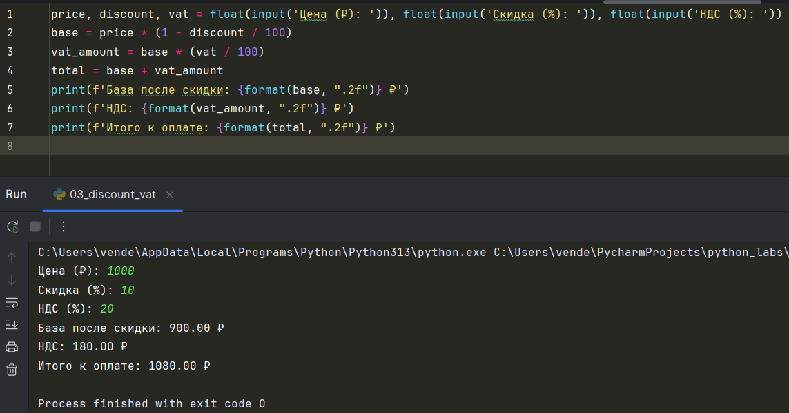

### Задание номер 4
```python
m = int(input('Минуты: '))
hours = (m // 60) % 24
minn = m % 60
if minn < 10:
    minn = '0' + str(minn)
print(f'{hours}:{minn}')
```
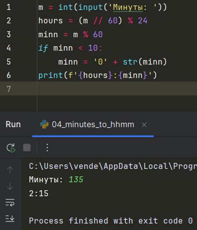

### Задание номер 5
```python
a = input('ФИО: ').split()
print(f'Инициалы: {a[0][0] + a[1][0] + a[2][0]}.')
print(f'Длина (символов): {len(a[0]) + len(a[1]) + len(a[2]) + 2}')
```
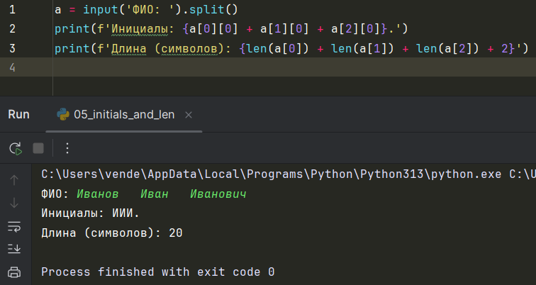

## Задание номер 6
```python
n = int(input('Пришло людей: '))
ochno, zaochno = 0, 0
for i in range(n):
    inf = input().split()
    if inf[3] == 'True':
        ochno += 1
    else:
        zaochno += 1
print(ochno, zaochno)
```
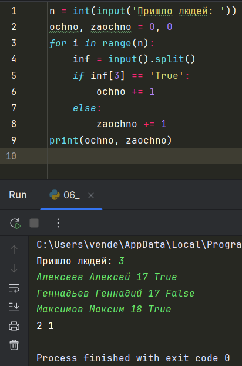


## Лабораторная работа 2

### Задание номер 1
``` python
def min_max(a):
    if not a:
        return ValueError
    return (min(a), max(a))


def unique_sorted(a):
    return sorted(set(a))


def flatten(a):
    row_major = []
    fl = False
    for a1 in a:
        if not isinstance(a1, (list, tuple)):
            fl = True
            break
        for i in range(len(a1)):
            row_major.append(a1[i])
    if fl:
        return TypeError
    return row_major


print('min_max')
print(min_max([3, -1, 5, 5, 0]))
print(min_max([42]))
print(min_max([-5, -2, -9]))
print(min_max([]))
print(min_max([1.5, 2, 2.0, -3.1]))
print('unique_sorted')
print(unique_sorted([3, 1, 2, 1, 3]))
print(unique_sorted([]))
print(unique_sorted([-1, -1, 0, 2, 2]))
print(unique_sorted([1.0, 1, 2.5, 2.5, 0]))
print('flatten')
print(flatten([[1, 2], [3, 4]]))
print(flatten([[1, 2], (3, 4, 5)]))
print(flatten([[1], [], [2, 3]]))
print(flatten([[1, 2], "ab"]))
```
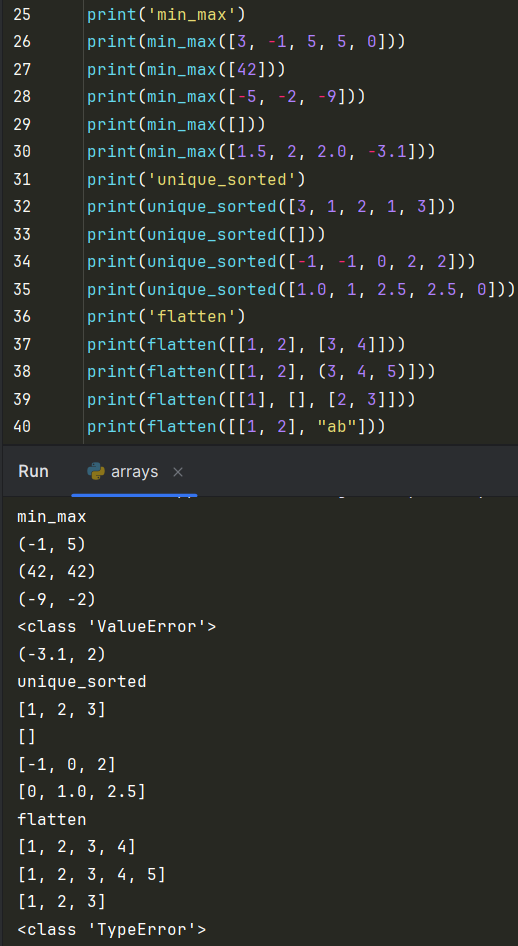

### Задание номер 2
``` python
def transpose(a):
    if a == []:
        return []
    if len(set(len(a1) for a1 in a)) != 1:
        return ValueError
    a_res = []
    for i in range(len(a[0])):
        new_list = []
        for k in range(len(a)):
            new_list.append(a[k][i])
        a_res.append(new_list)
    return a_res


def row_sums(a):
    if len(set(len(a1) for a1 in a)) != 1:
        return ValueError
    return [sum(a1) for a1 in a]


def col_sums(a):
    if a == []:
        return []
    if len(set(len(a1) for a1 in a)) != 1:
        return ValueError
    a_res = []
    for i in range(len(a[0])):
        new_list = []
        for k in range(len(a)):
            new_list.append(a[k][i])
        a_res.append(new_list)
    return [sum(a1) for a1 in a_res]


print('transpose')
print(transpose([[1, 2, 3]]))
print(transpose([[1], [2], [3]]))
print(transpose([[1, 2], [3, 4]]))
print(transpose([]))
print(transpose([[1, 2], [3]]))
print('row_sums')
print(row_sums([[1, 2, 3], [4, 5, 6]]))
print(row_sums([[-1, 1], [10, -10]]))
print(row_sums([[0, 0], [0, 0]]))
print(row_sums([[1, 2], [3]]))
print('col_sums')
print(col_sums([[1, 2, 3], [4, 5, 6]]))
print(col_sums([[-1, 1], [10, -10]]))
print(col_sums([[0, 0], [0, 0]]))
print(col_sums([[1, 2], [3]]))
```
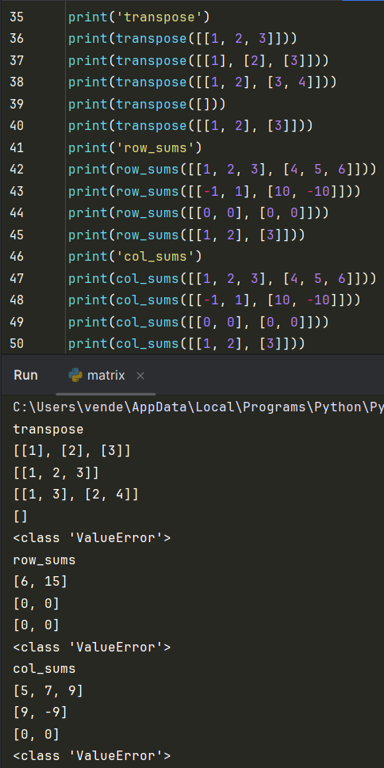

### Задание номер 3
``` python
def format_record(t):
    fio, group, gpa = t[0].strip(), t[1].strip(), round(t[2], 2)
    if not (len(fio.split()) == 2 or len(fio.split()) == 3) or group == '':
        return ValueError
    if not isinstance(gpa, float):
        return TypeError
    if len(fio.split()) == 3:
        l1, l2 = fio.split()[1], fio.split()[2]
        return fio.split()[0].capitalize() + ' ' + l1[0].upper() + '. ' + l2[0].upper() + '., гр. ' + group + ', GPA ' + f'{gpa:.2f}'
    else:
        l1 = fio.split()[1]
        return fio.split()[0].capitalize() + ' ' + l1[0].upper() + '., гр. ' + group + ', GPA ' + f'{gpa:.2f}'


print(format_record(("Иванов Иван Иванович", "BIVT-25", 4.6)))
print(format_record(("Петров Пётр", "IKBO-12", 5.0)))
print(format_record(("Петров Пётр Петрович", "IKBO-12", 5.0)))
print(format_record(("  сидорова  анна   сергеевна ", "ABB-01", 3.999)))
```
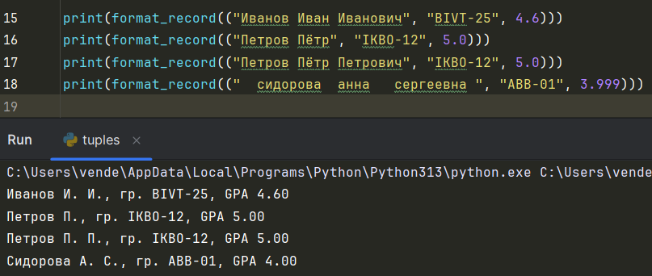


## Лабораторная работа 3

### Задание A
``` python
import re


def normalize(text: str, *, casefold: bool = True, yo2e: bool = True):
    if casefold: text = text.casefold()
    if yo2e: text = text.replace('Ё', 'Е').replace('ё', 'е')
    text = text.replace('\t', ' ').replace('\r', ' ').replace('\n', ' ').strip()
    while '  ' in text: text = text.replace('  ', ' ')
    return text


def tokenize(text):
    return re.findall(r'\w+[-]\w+|\w+', text.lower())


def count_freq(tokens):
    t = {}
    while tokens:
        t[tokens[0]] = tokens.count(tokens[0])
        tokens = [x for x in tokens if x != tokens[0]]
    return t


def top_n(freq, n):
    top_n = []
    freq = sorted(freq.items(), key=lambda item: [-item[1], item[0]])
    for i in range(min(n, len(freq))):
        top_n.append(freq[i])
    return top_n
```
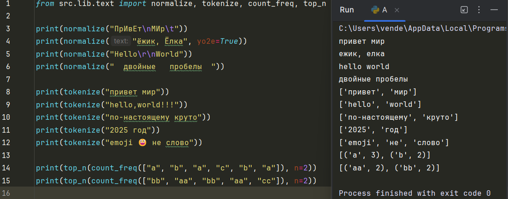

### Задание B
``` python
from src.lib.text import count_freq, top_n, normalize, tokenize
import sys
NICE_CONCLUSION = True
text = sys.stdin.read()
text = normalize(text)
tokens = tokenize(text)
top = top_n(count_freq(tokens), len(tokens))
print(f'Всего слов: {len(tokens)}')
print(f'Уникальных слов: {len(set(tokens))}')
print('Топ-5:')
if NICE_CONCLUSION:
    mx_len = max(5, len(max(tokens, key=len)))
    print('слово' + ' ' * (mx_len - 5) + ' | ' + 'частота')
    print('-' * (mx_len + 10))
    for i in top:
        print(i[0] + ' ' * (mx_len - len(i[0])) + ' | ' + str(i[1]))
else:
    for i in top:
        print(f'{i[0]}:{i[1]}')

```
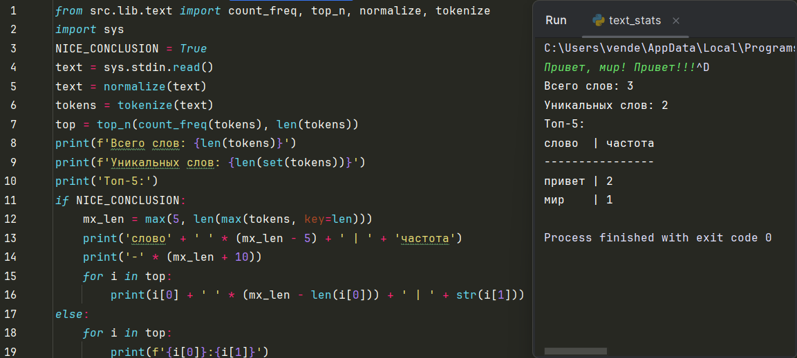


## Лабораторная работа 4

### Задание A
``` python
from pathlib import Path


def ensure_parent_dir(path: Path | str) -> None:
    p = Path(path)
    parent_dir = p.parent

    '''
    Создаёт родительские директории для указанного пути, если их ещё нет.

    Аргументы:
        path: путь к файлу (строка или pathlib.Path).
    '''

    parent_dir.mkdir(parents=True, exist_ok=True)


def read_text(path: str | Path, encoding: str = "utf-8") -> str:
    p = Path(path)  # Создаем путь к файлу - Path-объект

    '''
    Открывает текстовый файл и возвращает его содержимое как одну строку.

    Аргументы:
        path: путь к файлу (строка или pathlib.Path).
        encoding: кодировка файла (по умолчанию "utf-8").
                  Если нужна другая, можно указать, например: encoding="cp1251".

    Возвращает:
        str: содержимое файла.

    Падает с ошибками:
        FileNotFoundError: если файл не найден.
    '''

    if not p.exists():
        raise FileNotFoundError('Файл не найден')

    return p.read_text(encoding=encoding)


import csv
from typing import Iterable, Sequence


def write_csv(rows: Iterable[Sequence], path: str | Path, header: tuple[str, ...] | None = None) -> None:
    p = Path(path)  # Создаем путь
    rows = list(rows)

    '''
    Создать или перезаписать CSV-файл с разделителем ','.

    Аргументы:
        rows: последовательность строк (каждая строка — tuple или list).
        path: путь к CSV-файлу (строка или pathlib.Path).
        header: необязательный заголовок (tuple[str,...]), будет записан первой строкой.

    Падает с ошибками:
        ValueError: если не все из строк в rows имеют одинаковую длину.
    '''

    with p.open('w', newline='', encoding='utf-8') as f:
        w = csv.writer(f)  # Создание объекта writer для записи в csv формат
        if header is not None:
            w.writerow(header)  # Записываем заголовок, если такой существует

        if rows:  # Проверка не равную длину строк
            for r in rows:
                if len(r) != len(rows[0]):
                    raise ValueError("Строки имеют разную длину!")

        for r in rows:
            w.writerow(r)  # Записывает ряды построчно
```
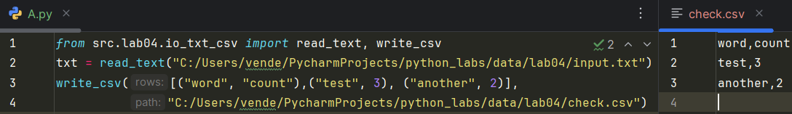
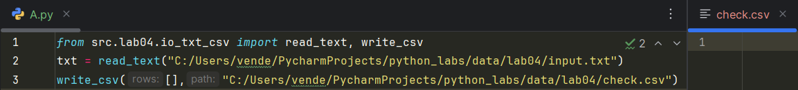
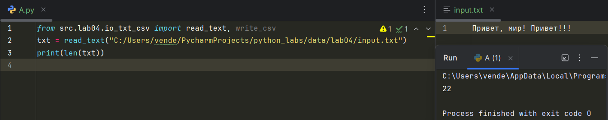


### Задание B
``` python
from src.lib.text import normalize, tokenize, count_freq, top_n
from src.lab04.io_txt_csv import read_text, write_csv

txt = read_text('C:/Users/vende/PycharmProjects/python_labs/data/lab04/input.txt', 'cp1251')
txt = tokenize(normalize(txt))
txt_counts = top_n(count_freq(txt))
print('Всего слов:', len(txt))
print('Уникальных слов:', len(set(txt)))
print('Топ-5:')
for i in txt_counts:
    print( f'{i[0]}:{i[1]}')

write_csv(txt_counts,
          'C:/Users/vende/PycharmProjects/python_labs/data/lab04/report.csv',
          ("word","count"))
```
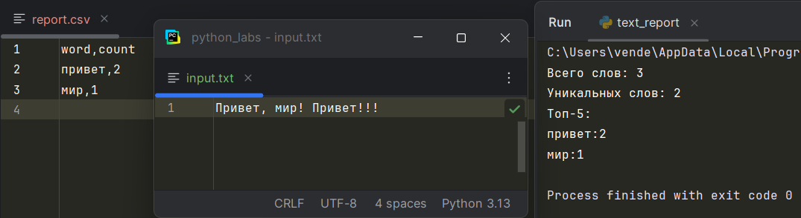
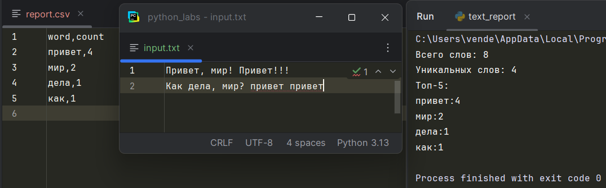
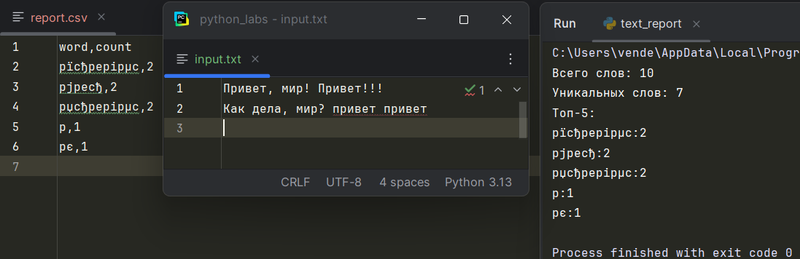


## Лабораторная работа 5

### Задание A
``` python
import csv
import json
from pathlib import Path


def json_to_csv(json_path: str, csv_path: str) -> None:
    json_path = Path(json_path)

    if json_path.exists() == False:
        raise FileNotFoundError

    if len(json_path.read_text(encoding="utf-8")) <= 0:
        raise ValueError

    with json_path.open("r", newline="", encoding='utf-8') as f:
        json_import = json.load(f)

    csv_path = Path(csv_path)

    with csv_path.open("w", newline="", encoding="utf-8") as f:
        csv_writer = csv.DictWriter(f, fieldnames=["name", 'age'])

        csv_writer.writeheader()
        csv_writer.writerows(json_import)

    """
        Преобразует JSON-файл в CSV.
        Поддерживает список словарей [{...}, {...}], заполняет отсутствующие поля пустыми строками.
        Кодировка UTF-8. Порядок колонок — как в первом объекте или алфавитный.
    """


def csv_to_json(csv_path: str, json_path: str) -> None:
    json_path = Path(json_path)
    csv_path = Path(csv_path)

    if csv_path.exists() == False:
        raise FileNotFoundError

    if len(csv_path.read_text(encoding="utf-8")) <= 0:
        raise ValueError

    list_line_csv = []

    with csv_path.open('r', encoding='utf-8') as f:
        csv_read = csv.DictReader(f)
        for line in csv_read:
            list_line_csv.append(line)

    with json_path.open("w", newline='', encoding="utf-8") as f:
        json_writer = json.dump(list_line_csv, f, ensure_ascii=False, indent=2)

    """
    Преобразует CSV в JSON (список словарей).
    Заголовок обязателен, значения сохраняются как строки.
    json.dump(..., ensure_ascii=False, indent=2)
    """
```
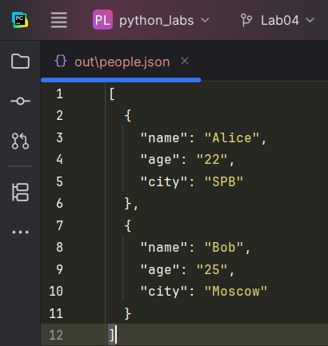
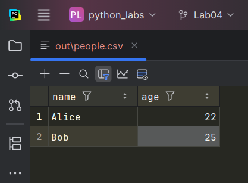

### Задание B
``` python
import openpyxl
from pathlib import Path
import csv


def csv_to_xlsx(csv_path: str, xlsx_path: str) -> None:
    """
    Конвертирует CSV в XLSX.
    Использовать openpyxl ИЛИ xlsxwriter.
    Первая строка CSV — заголовок.
    Лист называется "Sheet1".
    Колонки — автоширина по длине текста (не менее 8 символов).
    """
    csv_path = Path(csv_path)
    xlsx_path = Path(xlsx_path)

    if csv_path.exists() == False:
        raise FileNotFoundError

    if len(csv_path.read_text(encoding="utf-8")) <= 0:
        return ""

    xlsx_book = openpyxl.Workbook()
    xlsx_sheet1 = xlsx_book.active
    xlsx_sheet1.title = "Sheet1"

    with csv_path.open('r', encoding='utf-8') as f:
        csv_read = csv.reader(f)

        for row in csv_read:
            xlsx_sheet1.append(row)

    xlsx_book.save(xlsx_path)
```
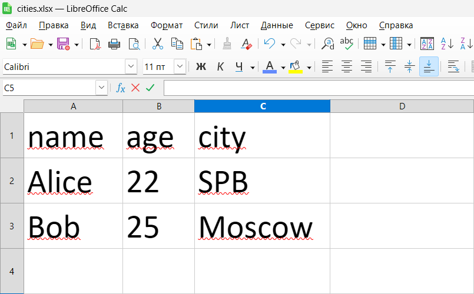


## Лабораторная работа 6

### Задание A
``` python
import argparse
from pathlib import Path
from src.lib.text import tokenize, count_freq, top_n


def main():
    parser = argparse.ArgumentParser(description='CLI-утилиты лабораторной №6')
    '''Создает основной парсер аргументов с описанием'''
    subparsers = parser.add_subparsers(dest='command')
    '''Создает подкоманды - в дальнейшем cat и stats'''

    # Подкоманда cat - утилита для просмотра содержимого текстовых файлов в терминале.
    cat_parser = subparsers.add_parser("cat", help="Вывести содержимое файла")
    cat_parser.add_argument("--input", required=True, help="Путь к входному файлу")
    cat_parser.add_argument("-n", action="store_true", help="Нумеровать строки")
    '''action="store_true" - если флаг указан, значение становится True, иначе False'''

    # Подкоманда stats - утилита для адализа текстовой статистики
    stats_parser = subparsers.add_parser("stats", help="Частоты слов")
    stats_parser.add_argument("--input", required=True)
    stats_parser.add_argument("--top", type=int, default=5)
    '''type=int - автоматически преобразует введенное значение в число, по дефолту
       выводит топ-5'''

    args = parser.parse_args()  # "Анализирует" значения на входе

    file = Path(args.input)

    if args.command == "cat":
        with open(file, 'r', encoding='utf-8') as f:
            count = 1
            for line in f:  # Построчное чтение файла
                line = line.rstrip("\n")  # Очищаем строку от символа переноса
                if args.n:  # Если указан флаг -n, то проводим нумерацию строк
                    print(f'{count}: {line}')
                    count += 1
                else:
                    print(line)

    elif args.command == 'stats':
        with open(file, 'r', encoding='utf-8') as f:
            file = [i for i in f]
            tokens = tokenize(''.join(file))
            freq = count_freq(tokens)
            top = top_n(freq, n=args.top)
            '''Работаем с входными данными'''

            num = 1

            for word, count in top:
                print(f'{num}. {word} - {count}')
                num += 1


# Точка - запуск программы
if __name__ == "__main__":
    main()
```
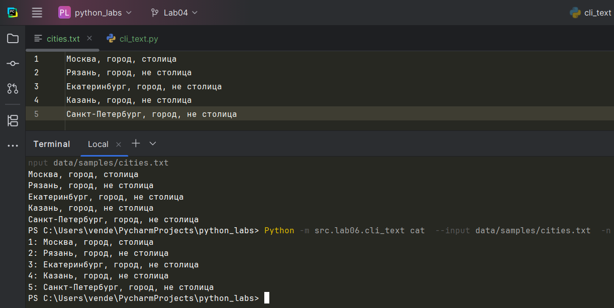
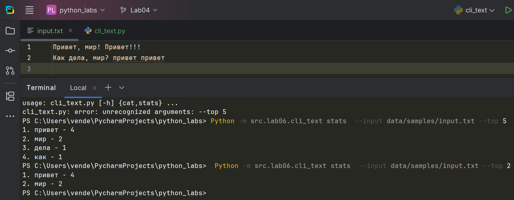

### Задание B
``` python
import argparse
from src.lab05.json_csv import json_to_csv
from src.lab05.json_csv import csv_to_json
from src.lab05.csv_xlsx import csv_to_xlsx


def main():
    parser = argparse.ArgumentParser(description="Конвертеры данных")
    sub = parser.add_subparsers(dest="command")

    p1 = sub.add_parser("json2csv")
    p1.add_argument("--in", dest="input", required=True)
    p1.add_argument("--out", dest="output", required=True)

    p2 = sub.add_parser("csv2json")
    p2.add_argument("--in", dest="input", required=True)
    p2.add_argument("--out", dest="output", required=True)

    p3 = sub.add_parser("csv2xlsx")
    p3.add_argument("--in", dest="input", required=True)
    p3.add_argument("--out", dest="output", required=True)

    args = parser.parse_args() # "Анализирует" значения на входе

    if args.command == "json2csv":
        # Python -m src.lab06.cli_convert json2csv --in data/samples/people.json --out data/out/people_from_json.csv
        json_to_csv(json_path=args.input, csv_path=args.output)

    if args.command == "csv2json":
        # Python -m src.lab06.cli_convert csv2json --in data/samples/people.csv --out data/out/people_from_csv.json
        csv_to_json(csv_path=args.input, json_path=args.output)

    if args.command == "csv2xlsx":
        # Python -m src.lab06.cli_convert csv2xlsx --in data/samples/cities.csv --out data/out/cities.xlsx
        csv_to_xlsx(csv_path=args.input, xlsx_path=args.output)

if __name__ == "__main__":
    main()
```
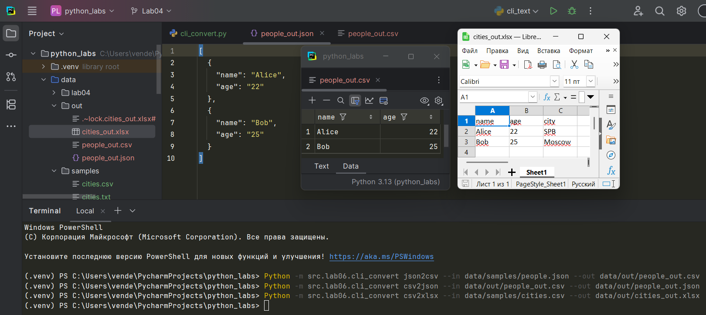


## Лабораторная работа 7

### Задание A
``` python
import pytest
from src import *

""" Проводим параметризацию, далее - для каждого теста. """


@pytest.mark.parametrize(
    "source, expected",
    [
        ("ПрИвЕт\nМИр\t", "привет мир"),
        ("ёжик, Ёлкa", "ежик, елкa"),
        ("Hello\r\nWorld", "hello world"),
        ("  двойные   пробелы  ", "двойные пробелы"),
        ("", "")
    ],
)
def test_normalize_basic(source, expected):
    assert normalize(source) == expected


@pytest.mark.parametrize(
    "source, expected",
    [
        ("привет, мир!", ["привет", "мир"]),
        ("по-настоящему круто", ["по-настоящему", "круто"]),  # работа с дефисом
        ("2025 год", ["2025", "год"]),  # чтение
        ("emoji 😀 не слово", ["emoji", "не", "слово"]),  # удаление эмоджи
        ("    мноооооого ненужного!!", ["мноооооого", "ненужного"]),
        ("", [])  # пустой -> пустой
    ],
)
def test_tokenize_basic(source, expected):
    assert tokenize(source) == expected


@pytest.mark.parametrize(
    "tokens, expected",
    [
        (["a", "b", "a", "c", "b", "a"], {"a": 3, "b": 2, "c": 1}),
        ([], {}),  # пустой -> пустой
        (["test", "test", "test"], {"test": 3}),  # одинаковые слова
        (["🌍", "🚀", "🌍"], {"🌍": 2, "🚀": 1})  # обработка эмодзи
    ],
)
def test_count_freq_and_top_n(tokens, expected):
    assert count_freq(tokens) == expected


@pytest.mark.parametrize(
    "words, n, expected",
    [
        ({"b": 5, "a": 5, "c": 3, "d": 2}, 2, [("a", 5), ("b", 5)]),  # равные значения -> по алфавиту
        ({"x": 10}, 5, [("x", 10)]),  # n > dicts
        ({}, 3, []),  # пустой -> пустой
        ({"a": 1, "b": 1}, 0, []),  # n = 0
    ]
)
def test_top_n_tie_breaker(words, n, expected):
    assert top_n(words, n) == expected
```
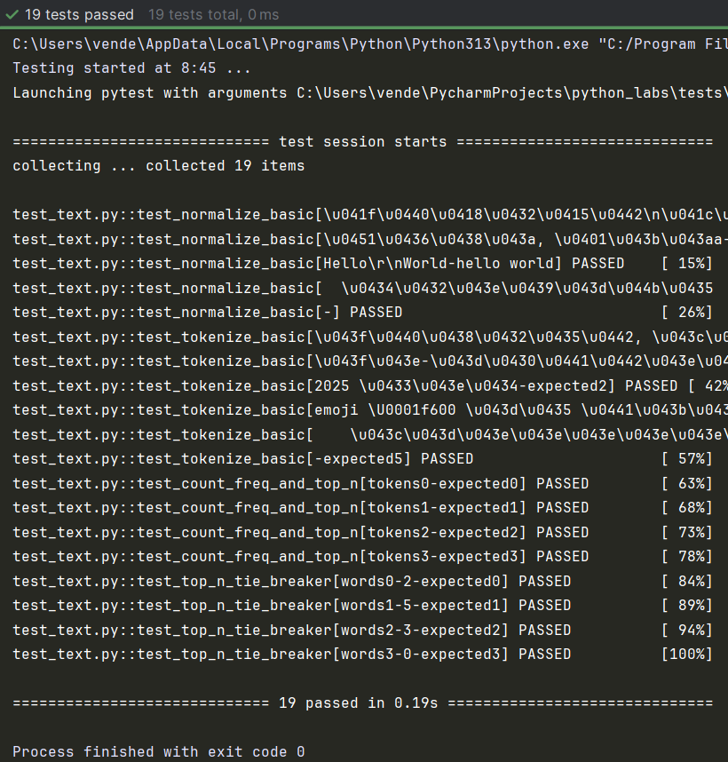

### Задание B
``` python
import pytest
from pathlib import Path
import sys
import json, csv
from src.lab05.json_csv import json_to_csv, csv_to_json

"""
С помощью фикстуры tmp_path создаём временные файлы для чтения и записы данных.
1 тест - проверка правильности записи базового случая
"""


def test_json_to_csv_roundtrip(tmp_path: Path):
    src = tmp_path / "people.json"
    dst = tmp_path / "people.csv"
    data = [
        {"name": "Alice", "age": 22},
        {"name": "Bob", "age": 25},
    ]
    src.write_text(json.dumps(data, ensure_ascii=False, indent=2), encoding="utf-8")
    json_to_csv(str(src), str(dst))

    with dst.open(encoding="utf-8") as f:
        rows = list(csv.DictReader(f))

    assert len(rows) == 2
    assert {"name", "age"} <= set(rows[0].keys())


"""Пустой файл"""


def test_json_to_csv_empty_file(tmp_path: Path):
    src = tmp_path / "people.json"
    dst = tmp_path / "people.csv"
    data = []
    src.write_text(json.dumps(data, ensure_ascii=False, indent=2), encoding="utf-8")

    with pytest.raises(ValueError, match="Пустой файл"):
        json_to_csv(str(src), str(dst))


"""Несуществующий путь"""


def test_json_to_csv_empty_file(tmp_path: Path):
    src = tmp_path / "nothing.json"
    dst = tmp_path / "people.csv"

    with pytest.raises(FileNotFoundError, match="Путь не найден"):
        json_to_csv(str(src), str(dst))


"""1 проверка формата"""


def test_json_to_csv_not_list(tmp_path: Path):
    src = tmp_path / "people.json"
    dst = tmp_path / "people.csv"
    data = {"name": "Alice", "age": 22}

    src.write_text(json.dumps(data, ensure_ascii=False, indent=2), encoding="utf-8")

    with pytest.raises(ValueError, match="Файл не JSON формата: не список словарей"):
        json_to_csv(str(src), str(dst))


"""2 проверка формата"""


def test_json_to_csv_not_dict(tmp_path: Path):
    src = tmp_path / "people.json"
    dst = tmp_path / "people.csv"
    data = ['name": "Alice", "age": 22', 'name": "Bob", "age": 25']

    src.write_text(json.dumps(data, ensure_ascii=False, indent=2), encoding="utf-8")

    with pytest.raises(ValueError, match="Файл не JSON формата: в списке не словари"):
        json_to_csv(str(src), str(dst))


"""Аналогично для обратного перевода"""


def test_csv_to_json_roundtrip(tmp_path: Path):
    src = tmp_path / "people.csv"
    dst = tmp_path / "people.json"

    csv_data = """name,age,city,email
Анна Иванова,28,Москва,anna@example.com
Петр Сидоров,35,Санкт-Петербург,petr@example.com"""

    src.write_text(csv_data, encoding="utf-8")

    csv_to_json(str(src), str(dst))

    with dst.open('r', encoding="utf-8") as f:
        data = json.load(f)

    # Проверка
    assert isinstance(data, list)
    assert len(data) == 2
    assert isinstance(data[0], dict)
    assert isinstance(data[1], dict)


"""Пустой файл"""


def test_csv_to_json_empty_file(tmp_path: Path):
    src = tmp_path / "people.csv"
    dst = tmp_path / "people.json"

    csv_data = ""

    src.write_text(csv_data, encoding="utf-8")

    with pytest.raises(ValueError, match="Пустой файл"):
        csv_to_json(str(src), str(dst))


"""Несуществующий файл"""


def test_csv_to_json_empty_file(tmp_path: Path):
    src = tmp_path / "nothing.csv"
    dst = tmp_path / "people.json"

    with pytest.raises(FileNotFoundError, match="Файл не найден"):
        csv_to_json(str(src), str(dst))


"""Не тот формат файла"""


def test_csv_to_json_type(tmp_path: Path):
    src = tmp_path / "input.txt"
    dst = tmp_path / "people.json"

    txt_data = """name,age,city,email
Анна Иванова,28,Москва,anna@example.com
Петр Сидоров,35,Санкт-Петербург,petr@example.com"""

    src.write_text(txt_data, encoding="utf-8")

    with pytest.raises(ValueError, match="Неверный тип файла"):
        csv_to_json(str(src), str(dst))
```
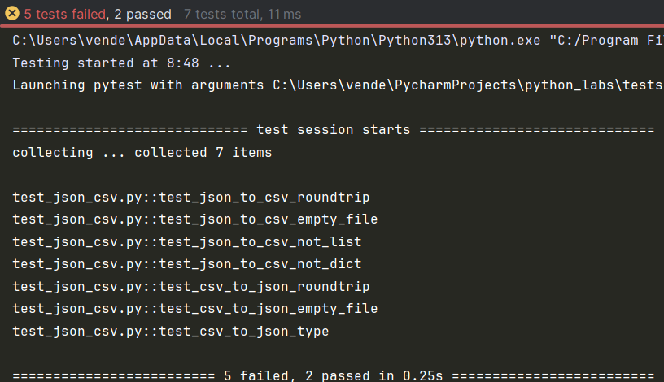


## Лабораторная работа 8

### Задание A
``` python
from dataclasses import dataclass
from datetime import datetime, date


@dataclass
class Student:
    fio: str
    birthdate: str
    group: str
    gpa: float

    def __post_init__(self):
        # Валидация формата даты
        try:
            datetime.strptime(self.birthdate, "%Y-%m-%d")
        except ValueError:
            raise ValueError("Неверная запись времени")

        # Валидация диапазона GPA
        if not (0 <= self.gpa <= 5):
            raise ValueError("GPA должен находиться между 0 и 5")

    def age(self) -> int:
        """Возвращает количество полных лет"""
        birth_day = datetime.strptime(self.birthdate, "%Y-%m-%d").date()
        today = date.today()
        if birth_day > today:
            raise ValueError("Студент еще не родился")
        if today.month < birth_day.month or (
                today.month == birth_day.month and today.day < birth_day.day
        ):
            return today.year - birth_day.year - 1
        return today.year - birth_day.year

    def to_dict(self) -> dict:
        return {
            "Студент": self.fio,
            "Группа": self.group,
            "Дата рождения": self.birthdate,
            "Средний балл": self.gpa,
        }

    @classmethod  # Метод создаёт новый объект из существующих данных
    def from_dict(cls, d: dict):
        # Создание объекта класса Student из словаря
        return cls(
            fio=d['Студент'], group=d["Группа"], birthdate=d["Дата рождения"], gpa=d["Средний балл"]
        )

    def __str__(self):
        return (f"Студент: {self.fio};\n"
                f"Группа: {self.group};\n"
                f"Дата рождения: {self.birthdate};\n"
                f"Средний балл: {self.gpa}.")


if __name__ == "__main__":
    student = Student("Иванов Иван Иванович", "2007-01-15", "БИВТ-25-1", 4.5)
    print(student)
    print("=" * 140)

    # age
    print(f"Возраст: {student.age()}")

    # to_dict
    student_dict = student.to_dict()
    print(f"Сериализованный: {student_dict}")

    # from_dict
    restored_student = Student.from_dict(student_dict)
    print(f"Десериализованный: {restored_student}")
```
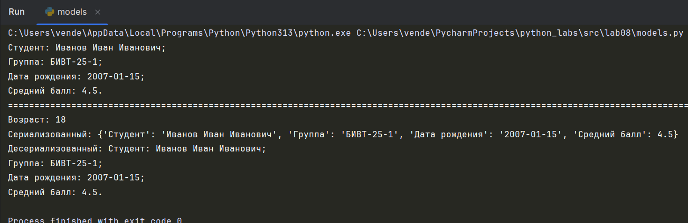

### Задание B
``` python
from dataclasses import dataclass
from datetime import datetime, date


@dataclass
class Student:
    fio: str
    birthdate: str
    group: str
    gpa: float

    def __post_init__(self):
        # Валидация формата даты
        try:
            datetime.strptime(self.birthdate, "%Y-%m-%d")
        except ValueError:
            raise ValueError("Неверная запись времени")

        # Валидация диапазона GPA
        if not (0 <= self.gpa <= 5):
            raise ValueError("GPA должен находиться между 0 и 5")

    def age(self) -> int:
        """Возвращает количество полных лет"""
        birth_day = datetime.strptime(self.birthdate, "%Y-%m-%d").date()
        today = date.today()
        if birth_day > today:
            raise ValueError("Студент еще не родился")
        if today.month < birth_day.month or (
                today.month == birth_day.month and today.day < birth_day.day
        ):
            return today.year - birth_day.year - 1
        return today.year - birth_day.year

    def to_dict(self) -> dict:
        return {
            "Студент": self.fio,
            "Группа": self.group,
            "Дата рождения": self.birthdate,
            "Средний балл": self.gpa,
        }

    @classmethod  # Метод создаёт новый объект из существующих данных
    def from_dict(cls, d: dict):
        # Создание объекта класса Student из словаря
        return cls(
            fio=d['Студент'], group=d["Группа"], birthdate=d["Дата рождения"], gpa=d["Средний балл"]
        )

    def __str__(self):
        return (f"Студент: {self.fio};\n"
                f"Группа: {self.group};\n"
                f"Дата рождения: {self.birthdate};\n"
                f"Средний балл: {self.gpa}.")


if __name__ == "__main__":
    student = Student("Иванов Иван Иванович", "2007-01-15", "БИВТ-25-1", 4.5)
    print(student)
    print("=" * 140)

    # age
    print(f"Возраст: {student.age()}")

    # to_dict
    student_dict = student.to_dict()
    print(f"Сериализованный: {student_dict}")

    # from_dict
    restored_student = Student.from_dict(student_dict)
    print(f"Десериализованный: {restored_student}")
```
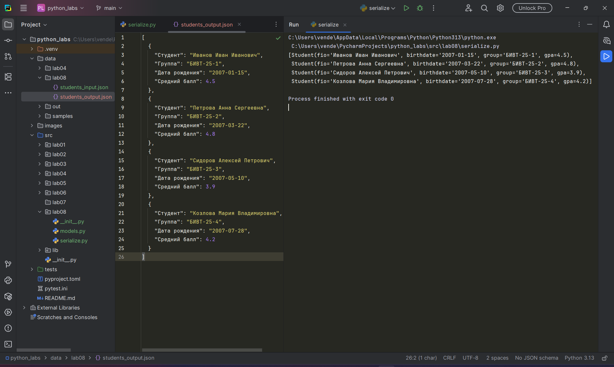